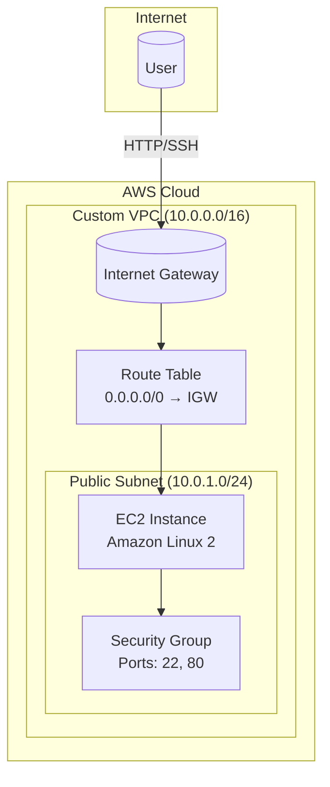

  <h1>🏗️ Terraform AWS Custom VPC Infrastructure with EC2 & Nginx</h1>
  
<em>Production-ready AWS networking automation with Infrastructure as Code</em>

  
  <!-- Badges -->
  

    
    
    
    
  

  
  <!-- Quick Links -->
  

    <a href="#-architecture-overview">Architecture</a> •
    <a href="#-features">Features</a> •
    <a href="#-quick-start">Quick Start</a> •
    <a href="#-configuration">Configuration</a> •
    <a href="#-troubleshooting">Troubleshooting</a> •
    <a href="#-cleanup">Cleanup</a>
  

---

Terraform AWS Custom VPC Infrastructure with EC2 and Nginx
Overview
This project provisions a complete AWS infrastructure using Terraform. It creates a custom VPC, public subnet, internet gateway, route table, security group, and EC2 instance. The EC2 instance is automatically configured to run an Nginx web server using a user-data script.
The goal of this project is to demonstrate Infrastructure as Code (IaC) practices using Terraform to automate cloud infrastructure deployment on AWS.
Architecture
The infrastructure created by this project includes:
Custom VPC
Public Subnet
Internet Gateway
Route Table and Route Association
Security Group
EC2 Instance
Nginx Web Server (installed automatically)

__Tech Stack:-__

  -Terraform

  -Amazon Web Services (AWS)

  -EC2

  -VPC

  -Nginx

  -Linux (Ubuntu)

__Project Structure__

terraform-aws-custom-vpc-infrastructure-with-ec2-and-nginx/

│

├── provider.tf

├── variables.tf

├── vpc.tf

├── subnet.tf

├── internet_gateway.tf

├── route_table.tf

├── security_group.tf

├── ec2.tf

├── outputs.tf

└── README.md

_Prerequisites__

-Before running this project, ensure you have:

-AWS Account

-AWS CLI installed and configured

-Terraform installed

-Existing AWS Key Pair for EC2 access

-Verify installations:

-terraform -v

-aws --version

-Configure AWS Credentials

-Run the following command to configure AWS CLI:

-aws configure

-Provide:

-AWS Access Key

-AWS Secret Key

-Default region (example: ap-south-1)

__Deployment Steps__

1. Clone the Repository
    git clone https://github.com/taranpreet-devops/terraform-aws-custom-vpc-infrastructure-with-ec2-and-nginx.git

    cd terraform-aws-custom-vpc-infrastructure-with-ec2-and-nginx

2. Initialize Terraform
terraform init

3. Validate Configuration
terraform validate

4. Preview Infrastructure Changes
terraform plan

5. Deploy Infrastructure
   

-terraform apply

-Type:

-yes

-Terraform will create all AWS resources.

-Terraform Output Example

-After successful deployment you will see something like:

-public_ip = 13.xxx.xxx.xxx

-Open the IP in your browser:

-http://<public_ip>

-You should see the Nginx welcome page.

-Access EC2 via SSH

-ssh -i your-key.pem ubuntu@<public-ip>

-Example:

-ssh -i mykey.pem ubuntu@13.xxx.xxx.xxx

-Demo

-Example output in browser:

-Welcome to nginx!

-If you see this page, the nginx web server is successfully installed.

-Destroy Infrastructure 

-To avoid AWS charges, destroy the resources when finished:

-terraform destroy

__DevOps Concepts Demonstrated__

This project demonstrates:

Infrastructure as Code (IaC)

AWS networking fundamentals

Automated infrastructure provisioning

Terraform workflow (init → plan → apply → destroy)

Server provisioning using user-data scripts

Future Improvements

__Possible enhancements:__

Use Terraform modules

Add private subnet + NAT gateway

Implement remote Terraform state (S3 + DynamoDB)

Add Application Load Balancer

Configure Auto Scaling Group

Add CI/CD pipeline using GitHub Actions

__Author__

Taranpreet Singh
GitHub: https://github.com/taranpreet-devops

__License__

This project is licensed under the MIT License.

